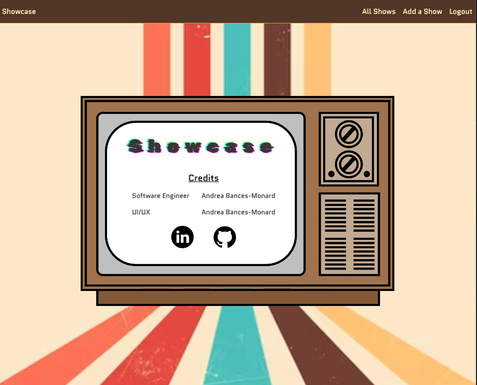

# Showcase
## Overview
Need a place to showcase your favorite shows, well this is the app for you. Showcase was created to make it easy to keep a list of all the current and future shows you would like to watch. 

## [Launch Showcase](https://andreashowcase.fly.dev/)

# Attributions:

- Fonts: [Google Fonts](https://fonts.google.com/)
- Glitch text animation: [Free FrontEnd](https://freefrontend.com/css-text-glitch-effects/) -Christine Banlawi
- Images: [Vecteezy](https://www.vecteezy.com/)
- Favicon, Github Icon, & Linkedin Icon: [Flaticon](https://www.flaticon.com)

# Technologies Used

- Python
- Django
- PostgreSQL
- HTML
- CSS
- Git
- Dockerfile
- Fly.io
- Supabase
- ~~Bit.io~~

# IceBox 🧊

- [ ] Implement photo uploads
- [ ] Adjust the model to also be able to add movies or podcasts
- [ ] Add a sort feature to sort shows by name, genre, or rating